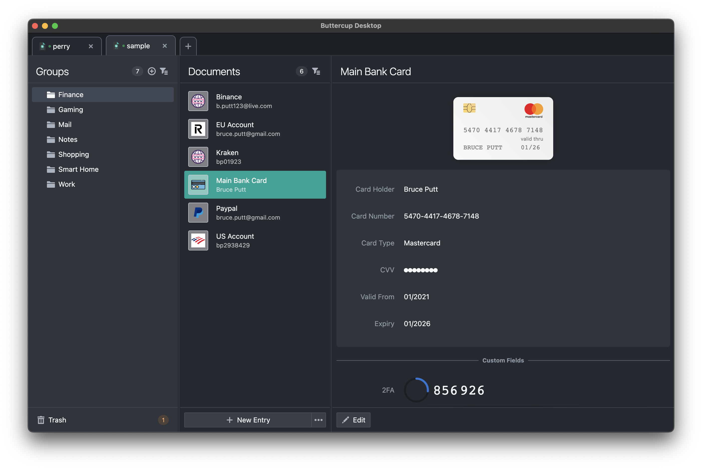

# 🌐 ButterCup WebDAV Server

The ButterCup password manager support 4 ways of managing secret vaults
1. Local vault file
2. Dropbox
3. Google Drive
4. Custom WebDav server

This reposiroy create this custom WebDav server and also adds authentications mechanisms like **LDAP** or **Basic static auth** in order to helpi small to medium companies to host an inhouse password manager using their LDAP or basic authentications methods.

## 📦 Prerequisites

Before getting started, make sure you have the following:

- **Docker** version **20.0** or higher
- Basic knowledge of Docker and WebDAV
- Download the Buttercup client from [Buttercup](https://buttercup.pw/)

## 🔒 Secure Access with TLS/HTTPS

To enable secure access to your WebDAV server using TLS/HTTPS, you can configure a **Traefik proxy** with automatic certificate management through Let's Encrypt. Follow the guide [here](https://doc.traefik.io/traefik/user-guides/docker-compose/acme-tls/) for setting up TLS using Traefik in your Docker environment.

## 📖 Usage Guide

1. Clone Repository

2. Edit the `.env` based on your preferences

2. Start the WebDAV Server: `docker compose up`

3. Open buttercup client to start using the service by providing
   - Url (`http://localhost`, domain or ip)
   - Username
   - Password
   

## 📚 References

- [ButterCup Password Panager](https://buttercup.pw/)
- [What is WebDAV?](https://www.jscape.com/blog/what-is-webdav)
- [ButterCup Desktop](https://github.com/buttercup/buttercup-desktop)
- [ButterCup Mobile](https://github.com/buttercup/buttercup-mobile)
